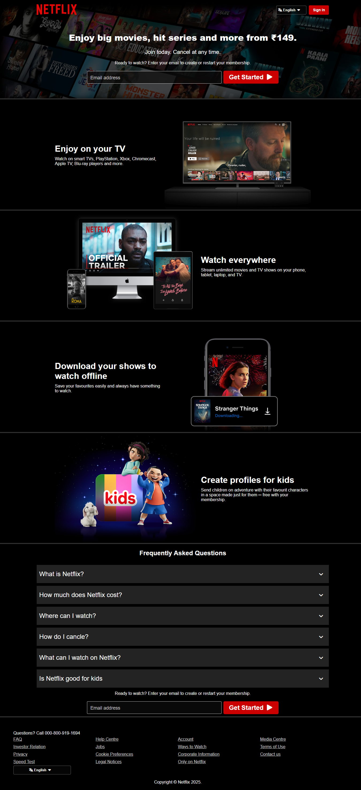

Live demo: (https://codewithmahir.github.io/streaming-website-clone

Description :
This repo is an educational landing page clone inspired by modern streaming service layouts. It is built for practice and UI replication only — not affiliated with or endorsed by Netflix.

Features :
Full-width hero with CTA
Responsive content rows (carousel-like static layout)
Sign-in/Sign-up modal (mock)
Footer with legal-like links (static)
Accessibility basics (semantic HTML, keyboard focus)
